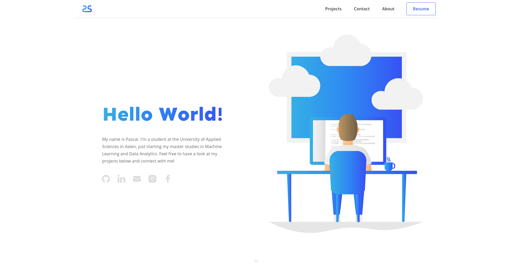

<h1 style="text-align: center">Personal portfolio of Pascal Schlaak (v3)</h1>

Have a look at my personal web portfolio hosted on Netlify. You can explore it <a href="https://www.pascalschlaak.ml">here</a>!

<a href="https://app.netlify.com/sites/silly-brown-ae01dc/deploys"></img></a>

</img>

